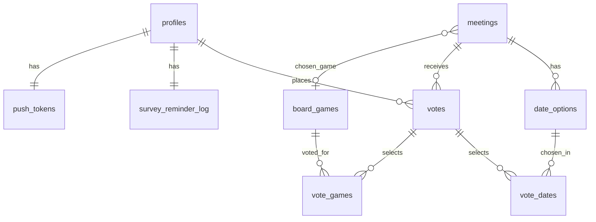
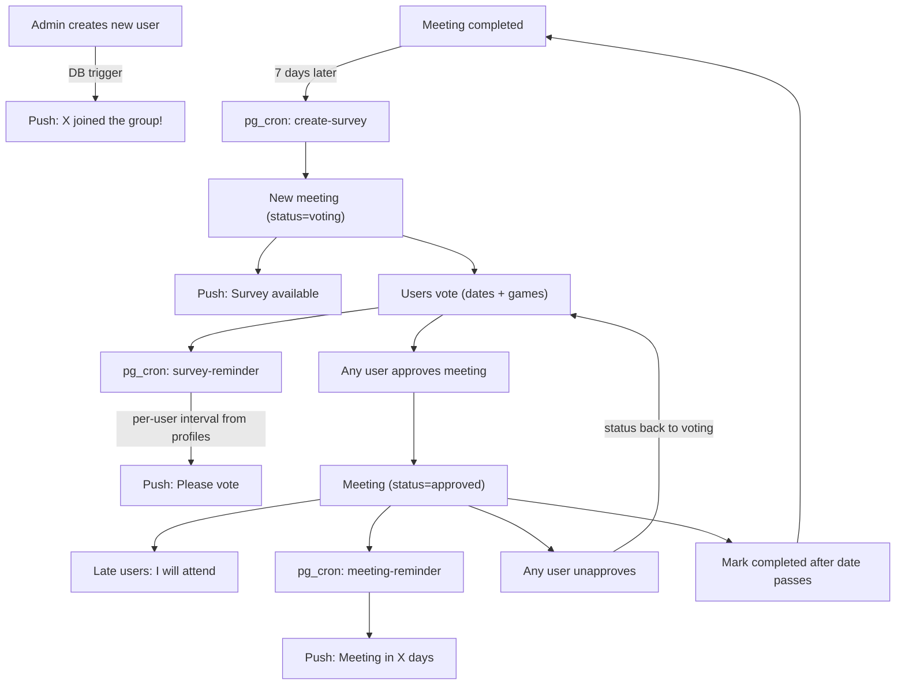

# BoardGames Meeting Planner App

## Tech Stack

- **Expo** (managed workflow) with **expo-router** (file-based navigation)
- **Platforms**: Android (primary), Web, iOS (secondary) -- Expo supports all three from one codebase
- **gluestack-ui** v2 for UI components
- **Supabase**: Auth, Postgres, Storage, Edge Functions, Realtime
- **Expo Notifications** for push notifications (Android/iOS; web uses browser notifications or polling)
- **TypeScript** throughout

## Database Schema

All tables live in Supabase Postgres. Key relationships:




### Tables

- **profiles** (extends `auth.users`): `id`, `username`, `name`, `surname`, `avatar_url`, `notification_prior_meeting` (default 1), `notification_reminder_interval` (default 2)
- **push_tokens**: `user_id` (PK, FK to profiles), `token`, `updated_at` -- separated from profiles to prevent exposure via SELECT; only the owning user can read/write their own row, Edge Functions access via `service_role` key
- **board_games**: `id`, `name`, `description`, `genre`, `min_players`, `max_players`, `tutorial_url`, `spotify_playlist_url`, `image_url` , `owners`
- **meetings**: `id`, `number`, `status` (voting/approved/completed), `chosen_date`, `chosen_game_id`, `approved_by`, `approved_at`, `voting_start_date`
- **date_options**: `id`, `meeting_id`, `date`, `is_custom`, `added_by` -- auto-generated weekends + Polish holidays + user-added custom dates
- **votes**: `id`, `meeting_id`, `user_id` -- one per user per meeting
- **vote_dates**: `(vote_id, date_option_id)` -- which dates user selected
- **vote_games**: `(vote_id, game_id)` -- which games user selected (applies to all their dates)
- **survey_reminder_log**: `user_id` (PK), `sent_at` -- one row per user, upserted each time a survey reminder is sent; cron checks `now() - sent_at >= notification_reminder_interval`

### RLS Policies

RLS is **enabled on all tables**. Anonymous/unauthenticated requests have zero access -- every policy requires `auth.uid() IS NOT NULL`.

**SELECT**:

- All authenticated users can SELECT all tables (single friend group) **except** `push_tokens`
- `push_tokens`: users can only SELECT their own row (`auth.uid() = user_id`)

**INSERT/UPDATE**:

- Users can INSERT/UPDATE only their own votes and profile
- All users can INSERT/UPDATE meetings (approve/unapprove/complete)
- All users can INSERT/UPDATE board_games
- `push_tokens`: users can only INSERT/UPDATE their own row (`auth.uid() = user_id`)

**DELETE**:

- `votes`: users can DELETE only their own votes (`auth.uid() = user_id`)
- `vote_dates`, `vote_games`: users can DELETE only entries belonging to their own votes (join through `votes.user_id`)
- `board_games`: any authenticated user can DELETE (acceptable for friend group)
- `meetings`, `date_options`: no client DELETE (only status transitions)
- `profiles`, `push_tokens`: no DELETE

**Server-only**:

- `survey_reminder_log`: no client access (only written by Edge Functions using the `service_role` key)
- `push_tokens`: Edge Functions read all tokens via `service_role` key (bypasses RLS) for sending push notifications

**Storage & project settings**:

- Storage bucket `avatars` and `game-images`: authenticated read/write, no public access
- Supabase project settings: disable email sign-ups (no self-registration; users created manually by admin in Supabase Dashboard)

### Key Database Functions (Supabase SQL functions)

- `get_consecutive_game_count(game_id)` -- counts how many recent consecutive completed meetings used this game (for the "3 plays" rule)
- `create_next_survey()` -- finds latest completed meeting (by `number`), creates a new meeting in "voting" status with auto-generated date_options (weekends + Polish holidays in the valid range, starting from 2nd weekend after the last meeting date)

### Indexes

- `meetings.number` -- UNIQUE, DESC index; used for lookups like "latest completed meeting", consecutive game count
- `votes(meeting_id, user_id)` -- UNIQUE constraint (already enforced by schema); indexed for fast per-meeting voter lookups
- `date_options(meeting_id, date)` -- UNIQUE constraint; indexed for date option queries per meeting
- `vote_dates.date_option_id` -- index; used when counting votes per date
- `vote_games.game_id` -- index; used when counting votes per game

## Polish Public Holidays

Utility in both SQL and TypeScript to compute Polish holidays for a given year:

- Fixed: Jan 1, Jan 6, May 1, May 3, Aug 15, Nov 1, Nov 11, Dec 25, Dec 26
- Easter-dependent (computed via Gauss algorithm): Easter Sunday, Easter Monday, Corpus Christi (Easter+60), Pentecost (Easter+49)

## Auth Flow

- **No self-registration** -- email sign-ups disabled in Supabase Auth settings. Users are created manually by admin in Supabase Dashboard (Auth > Users > "Add User") with `email_confirm: true`. Temp password shared verbally or via chat. Users change password in Profile screen after first login.
- Root `_layout.tsx` checks Supabase session on mount via `supabase.auth.getSession()`
- Subscribes to `onAuthStateChange` for session updates
- No session -> redirect to `(auth)/login`
- Has session -> redirect to `(tabs)/`
- A Supabase trigger (`on_auth_user_created`) auto-inserts a `profiles` row. On first login, user uploads avatar in Profile, updates `profiles.avatar_url`, registers Expo push token -> `push_tokens` table
- **On new profile insert**: a database trigger/Edge Function sends push notification to all other users ("X joined the group!")
- **Login screen**: email + password, "Stay logged in" toggle (default on). When enabled, Supabase client is configured with `persistSession: true` so the session is stored locally and auto-refreshed -- user stays logged in across app restarts. When disabled, session is only kept in memory for the current app session.

**Supabase Auth hardening** (configure in Dashboard > Authentication > Settings):

- Disable email sign-ups (noted above)
- Disable anonymous sign-in
- Disable all social/OAuth providers
- Disable phone auth
- Enable email confirmation requirement
- Supabase has built-in auth rate limiting (~30 requests/hour per IP for signup/login) -- no additional config needed

## Project Structure

```
boardgames/
  app/                          # Expo Router screens (React Native)
    _layout.tsx                 # Root: auth guard, Supabase provider
    (auth)/
      _layout.tsx
      login.tsx
    (tabs)/
      _layout.tsx               # Bottom tab navigator
      index.tsx                 # HOME: next meeting or active survey
      games/
        _layout.tsx             # Stack navigator
        index.tsx               # Board games list
        [id].tsx                # Game detail + edit
        new.tsx                 # Add new game
      profile.tsx               # Profile + notification settings
    survey/[id].tsx             # Full survey voting screen
    approve/[id].tsx            # Meeting approval screen
  lib/                          # Shared utilities, types, Supabase client
  supabase/                     # Supabase project (migrations + functions version-controlled)
    functions/                  # Edge Functions (create-survey, survey-reminder, etc.)
    migrations/                 # SQL migrations
    config.toml                 # Supabase local config (IN .gitignore -- template as config.toml.example)
  .env                          # Supabase keys (IN .gitignore)
  .gitignore
```

### Key Screens

**Home (`(tabs)/index.tsx`)**

- If meeting with status=`approved` exists: show meeting card (game name, description, tutorial link, Spotify playlist, attendee avatars/initials). 
  - Button to "add to calendar" which would reference the calendar app with whole-day meeting event creation on selected day
  - Button to unapprove
- If meeting with status=`voting` exists: show survey summary + "Vote" CTA
- If neither: show "No upcoming meetings" state, info when new voting will be available and button "create new voting now"

**Survey (`survey/[id].tsx`)**

- Doodle-style date picker showing available date_options (multi-select): weekends, holidays, custom_dates 
- Past date_options are disabled (greyed out)
- "Add custom date" button to add a date in the valid range
- Game selection: multi-select cards with game images
  - If consecutive plays < 3: pre-select current game, show warning if user tries to change
  - If consecutive plays >= 3: mandatory new pick, warn if same game selected
- "Not participating" option -- submits a vote with no date_options or games selected (presence in `votes` without `vote_dates`/`vote_games` = not participating)
- Shows who voted for what (avatar circles per date and per game)
- Submit button

**Approve (`approve/[id].tsx`)**

- Date picker sorted by vote count (descending)
- Not showing past dates
- After picking date: game picker sorted by votes from people who voted for that date only
- Confirm button -> sets meeting status=`approved`
- "I will attend" button (on approved meeting view only for users who have no vote_date for this day): creates a `votes` entry with `vote_dates` for the chosen date + `vote_games` for the chosen game

**Games (`(tabs)/games/`)**

- List with search, showing name, genre, player count, owners (text[])
- Detail screen with edit/delete, photo upload, all fields including owners as free-text list
- New game form

**Profile (`(tabs)/profile.tsx`)**

- Avatar upload, name/surname/username/password edit
- Notification settings: how many days before meeting, how often remind about survey in days
- Logout button (calls `supabase.auth.signOut()`, clears push token from `push_tokens`)

## Notifications (Supabase Edge Functions + Expo Push)

Edge Functions triggered by `pg_cron` or database triggers:

1. `**create-survey`** (pg_cron, daily): checks if any completed meeting is >= 7 days old without a follow-up survey; if so, creates one via `create_next_survey()` and sends push to all users.
2. `**survey-reminder`** (pg_cron, daily): for active surveys, finds users who haven't voted and whose `survey_reminder_log.sent_at` is >= `notification_reminder_interval` days ago (per-user setting) or has no entry yet; sends push and upserts `survey_reminder_log`.
3. `**meeting-reminder`** (pg_cron, daily): for approved meetings, sends push to attendees whose meeting is within `notification_prior_meeting` days (per-user setting). One-shot, no log needed.
4. `**new-user-notification`** (DB trigger on `profiles` INSERT): sends push to all existing users notifying them a new member joined.

Push notifications sent via Expo Push API using tokens from `push_tokens` table (read by Edge Functions via `service_role` key).

Additionally, **Supabase Realtime** subscriptions on the `meetings` table to instantly notify the app when a meeting is edited/unapproved (in-app handling).

## Data Flow




## Secrets & Security (public repo)

The source code is hosted as a **public GitHub repo**. Key rules:

- `**.gitignore`** must include: `.env`, `supabase/.temp/`, `supabase/.branches/`, `supabase/config.toml` (contains project-id -- template as `config.toml.example` with placeholder values)
- **Version-controlled**: `supabase/migrations/`, `supabase/functions/`, `supabase/seed.sql` -- these contain no secrets and must be tracked (single developer -- losing local machine would mean total loss of schema, RLS policies, and function code)
- `**.env`** stores: `EXPO_PUBLIC_SUPABASE_URL`, `EXPO_PUBLIC_SUPABASE_KEY` (these are safe client-side but still gitignored for cleanliness)
- `**service_role` key**: NEVER in client code; only used inside Edge Functions (server-side) and set via `supabase secrets set`
- **Edge Functions secret handling**: access secrets exclusively via `Deno.env.get('SUPABASE_SERVICE_ROLE_KEY')` -- never hardcode. All secrets set via `supabase secrets set` (stored in Supabase platform, not in code). Source code is safe for public repo.
- **Supabase anon key**: safe to be in the client app (designed for this); all access is gated by RLS. The URL and anon key are also embedded in the compiled app binary (APK/IPA/JS bundle) regardless of `.gitignore` -- this is by design. RLS policies are the actual security boundary, not key secrecy.
- **Expo push credentials**: managed via EAS, not committed
- Passwords are bcrypt-hashed by Supabase Auth -- not reversible even by DB admins

## Implementation Order

Work is split into 8 phases, each buildable and testable independently.